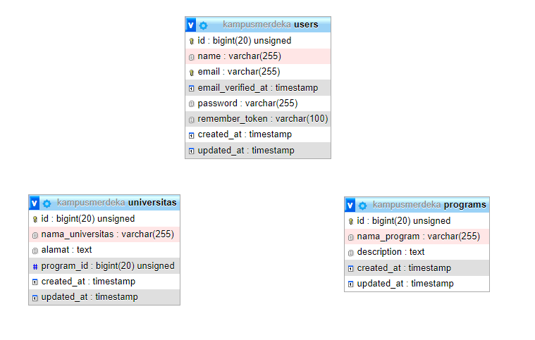
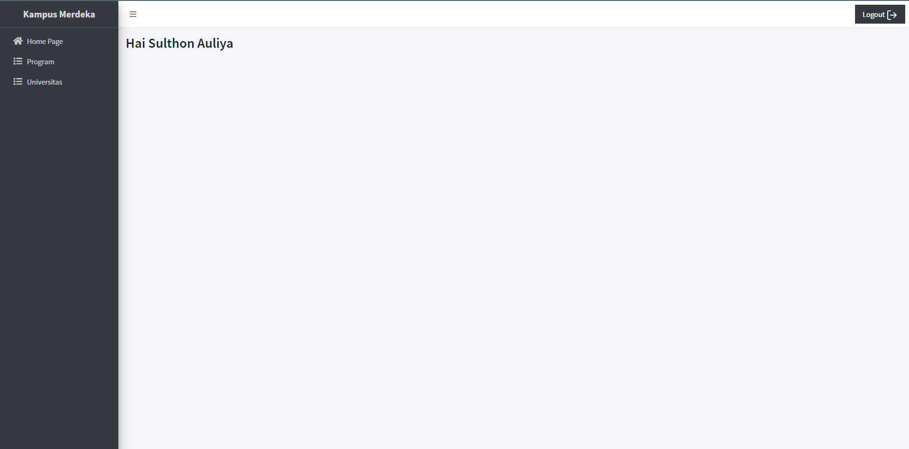
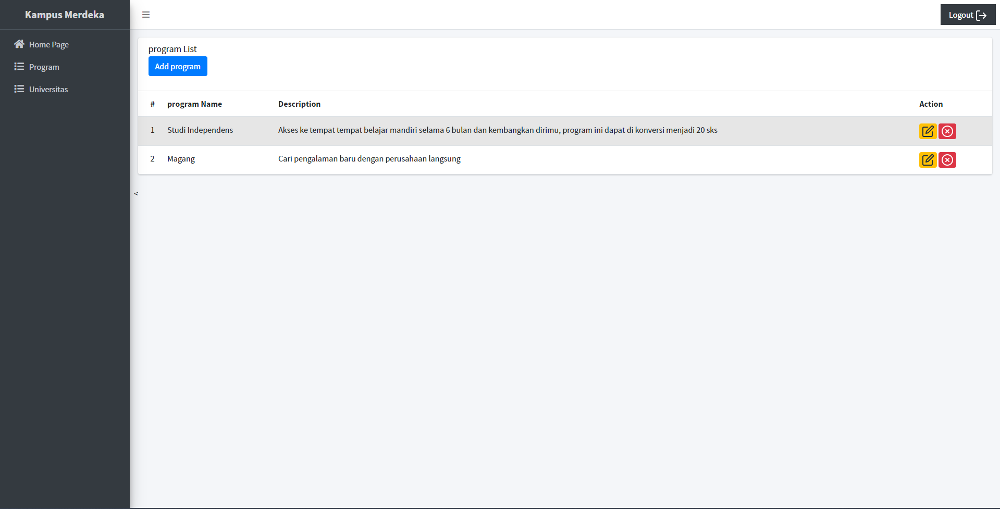
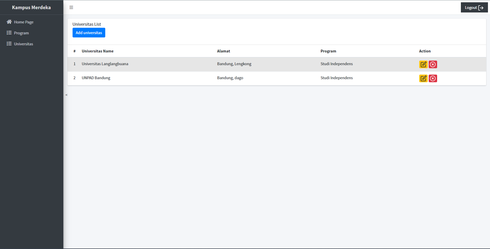

## About this app (kampusmerdeka)

kampusmerdeka adalah mini website yang dibuat untuk seleksi magang pada program Kampus Merdeka tahun 2022, web ini merupakan web mengenai data universitas yang mengikuti program pada kampus merdeka

- API aplikasi
- dashbord untuk mengatur data universitas dan program yang ada pada kampus merdeka

## Design Database

## Screenshoot Aplikasi

- Home

- programs

- universitas

### API
Berikut adalah link yang dapat digunakan untuk mengakses collection API aplikasi ini
<a href="https://www.getpostman.com/collections/4deb1942a30abe6ce370](https://documenter.getpostman.com/view/9171602/UzQyphxf)">Dokumentasi API</a>

- sesuaikan domain aplikasi pada server lokal, jika menggunakan "php artisan serve" maka ganti link menjadi "127.0.0.1"

